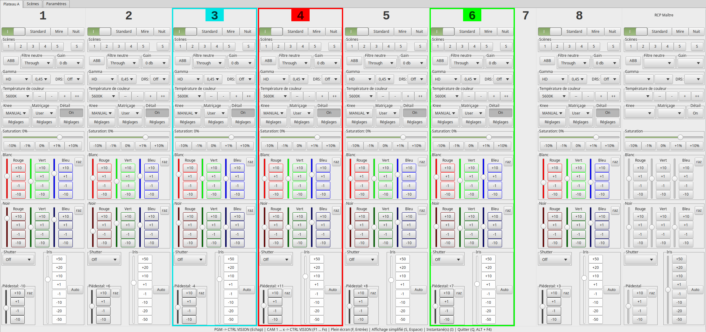
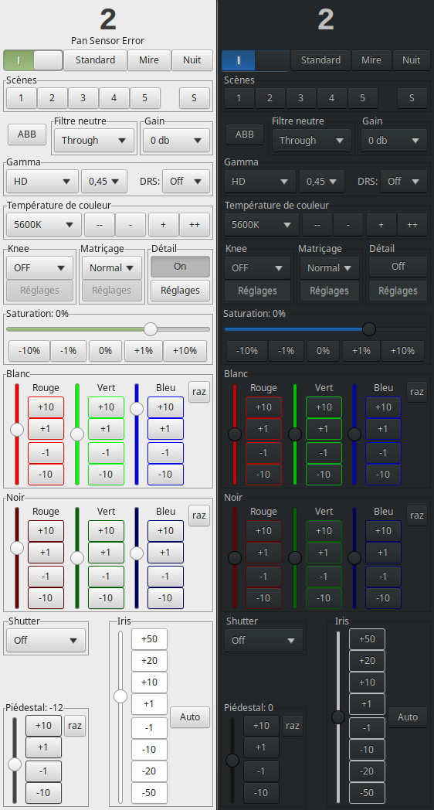

# RCP virtuels pour caméras Panasonic AW-HE130 et AW-UE150

## Paramètres :

### Réglages communs à toutes les caméras :

Le **réglage important** (et qui ne peut pas être modifié) est le « White Balance Mode » qui est réglé sur « VAR » pour que le logiciel puisse sauvegarder la température de couleur (parce qu’il n’est pas possible d’accéder aux valeurs calculées par les caméras dans les mémoires AWB A et B). Cela permet d’implémenter 10 vraies mémoires que l'on peut enregistrer et rappeler à la demande (les 4 scènes des caméras sont ignorées).

Le « Preset Scope » sera probablement toujours en « mode C » pour que personne d'autre ne touche à la colorimétrie des caméras.

Tous ces paramètres sont contrôlés au démarrage (sauf les réglages des 4 sorties vidéos pour les AW-UE150) et en permanence via le mécanisme des « update notifications » pour que personne ne puisse les modifier par inadvertance depuis un autre pupitre (par contre il ne faudrait surtout pas qu'il y ai plusieurs logiciels avec des réglages différents qui s'exécutent en même temps, ils se battraient pour imposer leurs réglages et abîmeraient la mémoire interne des caméras). Il est possible de désactiver cette fonctionnalité en ajoutant la ligne « #define MAIN_SETTINGS_READ_ONLY » en tête du fichier « rcp.h ».

### Connexion avec la régie :
Il est possible d'interfacer le logiciel avec la régie (Tallyman, Cerebrum, …) via le protocole « SW-P-08 » (en liaison IP ou série) pour choisir l’ « ensemble de caméras » actif, commuter automatiquement la sortie SDI de la caméra sélectionnée dans un moniteur de contrôle (et vice versa), et rappeler des mémoires.

Explication, le logiciel est vu comme une grille (17 sources, 5 destinations) :

Par exemple, si le RCP virtuel n°2 de l’ « ensemble de caméras » actif est sélectionné, le logiciel indique à la régie le point de croisement « 2 » -> « 2 : RCP » et il faut avoir programmé le Tallyman/Cerebrum/ou autres en conséquence pour qu'il demande à la grille centrale de faire le point de croisement de la sortie SDI de la caméra correspondante vers le moniteur vision.

Appuyer sur la touche « Echap » réalise le point de croisement « Echap » -> « 2 : RCP » de façon à pouvoir programmer la commutation du PGM dans le moniteur vision.

A l’inverse, en demandant le point de croisement approprié, la régie peut sélectionner l’ « ensemble de caméras » actif (changement de configuration d’émission), le RCP actif (pour suivre l’action « des coups de poing » au poste vision) et rappeler la mémoire n°X de tous les RCP de l’ « ensemble de caméras » actif.

Si l’utilisation du protocole « TSL UMD V5 » est impossible, il est possible d’avoir les rouges antennes par le même mécanisme. Si la caméra 6 est à l'antenne la programmation du Tallyman/Cerebrum/ou autres doit faire en sorte de demander la réalisation du point de croisement « 6 » -> « 4 : PGM » et le RCP virtuel n°6 sera cerclé de rouge dans l'interface.

### Utilisation d’un RCP Physique :
Il est possible d’utiliser un RCP Panasonic AK-HRP200 pour piloter la caméra sélectionnée à travers le logiciel.

Pour la configuration, le logiciel est vu par le RCP comme une caméra normale et il faut utiliser un port TCP/IP supérieur à 1024.

Toutes les fonctionnalités sont accessibles (sauf l’ « auto white » et le rappel des 4 scènes qui n’ont pas de sens) et une fois que le RCP a rattrapé les valeurs du logiciel (voyant « IRIS/M.PED LOCK » qui ne clignote plus), nous bénéficions d’un iris et d’un piédestal relatif peu importe la caméra réellement pilotée. (Pour une raison encore inconnue le piédestal ne marche pas!)

Le bouton « HEAD POWER » allume ou éteint la caméra sélectionnée.

## Ensembles de caméras :
Les caméras (une adresse IP et un nom sur 2 caractères) sont déclarées dans les « ensembles de caméras ».

Il y a la possibilité de déclarer des caméras « inactives » pour représenter des caméras non pilotable.

Il est possible d'avoir une même caméra déclarée dans plusieurs « ensembles de caméras », potentiellement avec des noms différents, pour le cas où l'on souhaiterait regrouper les caméras par émissions avec des numérotations différentes par exemple.

Une fois configuré, il suffit de cliquer sur l'onglet correspondant à l'ensemble de caméra et nous avons accès à tous les réglages colorimétriques des caméras.

Il y a vraiment accès à tout les réglages qui concerne la vision pour ne jamais avoir besoin d'aller dans le menu des caméras.

Pour pourvoir interagir avec un RCP il faut d’abord le sélectionner en cliquant n'importe où dessus (et le Tallyman, Cerebrum ou autres est sensé faire sa commute de grille à ce moment là).

Il y a une zone d'affichage des messages d'erreur transmis par les caméras.

Le bouton Standard rappelle des valeurs par défaut.

Il est possible d'enregistrer les réglages de chaque RCP virtuel dans 10 « Scènes » (il faut cliquer sur le bouton « S » puis sur le numéro de la « Scène ») et de les rappeler (en cliquant directement sur le numéro de la « Scène »). Il faut maintenir la touche « Shift » enfoncée pour accéder aux mémoires 6 à 10.

La température de couleur se règle manuellement (pour pouvoir la sauvegarder, cf « White Balance Mode » en mode « VAR »).

Les différents boutons « +1 », « +10 », ... font évoluer leurs paramètres respectivement de plus une unité, plus dix unités, ...
Si on maintient ces boutons appuyés, ils continuent d'incrémenter toutes les 130ms. L'utilisation du clic droit « inverse » ces boutons (le + devient un - et vice versa), cela permet d'affiner un réglage sans quitter le moniteur de contrôle des yeux. 

Le gain « Vert », qui n’existe pas dans la réalité (sauf celui des blancs pour les AW-UE150), fait évoluer les gains rouge et bleu en sens inverse.

Les valeurs de « Shutter synchro » affichées ne sont pas celles de Panasonic (il faudrait certainement taper à la main les 2x255 valeurs pour les AW-HE130 et pour les AW-UE150 c'est pire)

## Scènes :
Dans l'onglet « Scènes », il est possible de copier une mémoire d'une caméra dans une autre caméra (y compris partiellement, on peut par exemple appliquer un matriçage complexe à plusieurs caméras sans toucher aux réglages de détail).

## Touches utiles :
Q : quitte le logiciel.

S ou Espace : affichage complet/simplifié des RCP.

F : mode plein écran/mode fenêtré.

Fn : Sélectionne le n^ème RCP et en informe la régie (point de croisement « n° » -> « 2 : RCP »).

Echap : Informe la régie du point de croisement « Echap » -> « 2 : RCP ».

Shift : donne accès aux mémoires 6 à 10.

S/P : Verrouille respectivement l’axe de la saturation ou de la phase lors des corrections de couleurs (matriçage).

I : Récupère une image jpeg (qualité n°1) de la caméra sélectionnée ou de toutes les caméras de l'ensemble actif.

## Divers :
En laissant la souris immobile sur certains paramètres, il y a une info bulle qui apparaît avec la notice correspondante.

La configuration et les mémoires des RCP sont stockées dans le fichier « RCP-Virtuels.dat ».

Il y a un petit fichier icône tout moche « RCP-Virtuels.ico ».

Les éventuelles erreurs générées par les caméras sont enregistrées dans les fichiers journaliers « 'date'_Errors.log ».

Les fichiers dans le dossier « resources » définissent l’aspect de l’interface du programme.

## Screenshots

